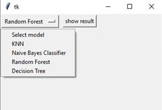
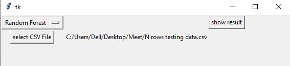
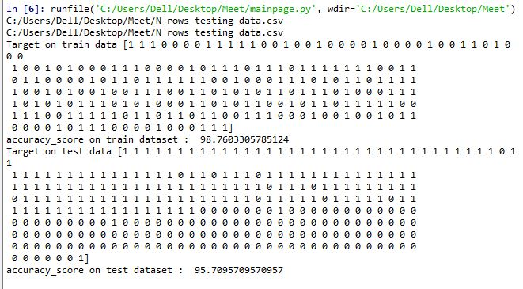

# Machine-Learning-Using-Pyhton-GUI
A GUI based ( Tkinter) python application that allows the user to apply any machine learning algorithm on a user-provided CSV file, without having any prior knowledge of programming. The application gives an special feature for users to provide training data and once the model is train they can select the testing CSV file to check the accuracy. The testing model can be one entry or N number of entries the code calculated accuracy of all the testing data based on training data provided by the user.

Requirements: Python 3, pandas, matplotlib, scikit learn.

Steps to follow (Users):

1) Select which regression you want to apply.

2) Give the path of the file using browsing options.

3) press show results for obtaining accuracy on the testing data provided.

